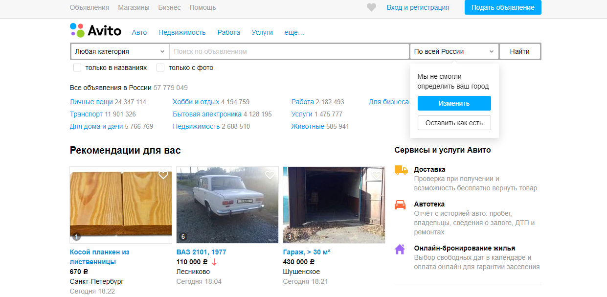
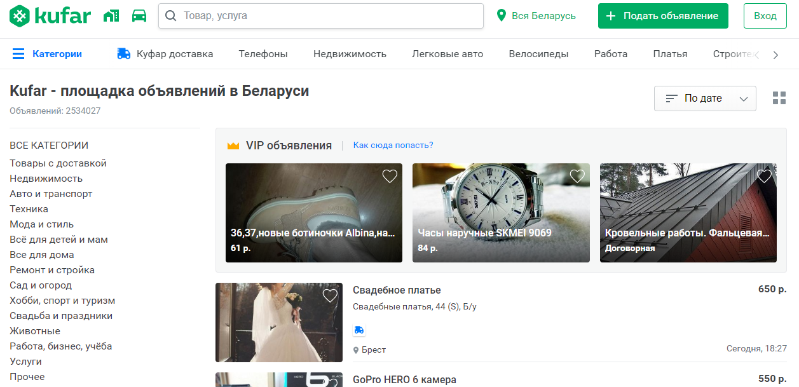
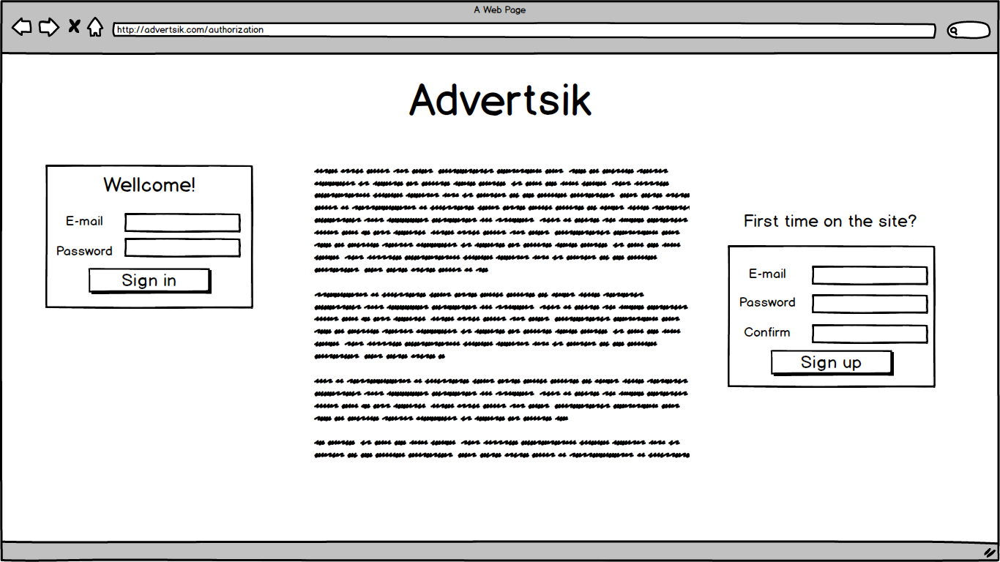
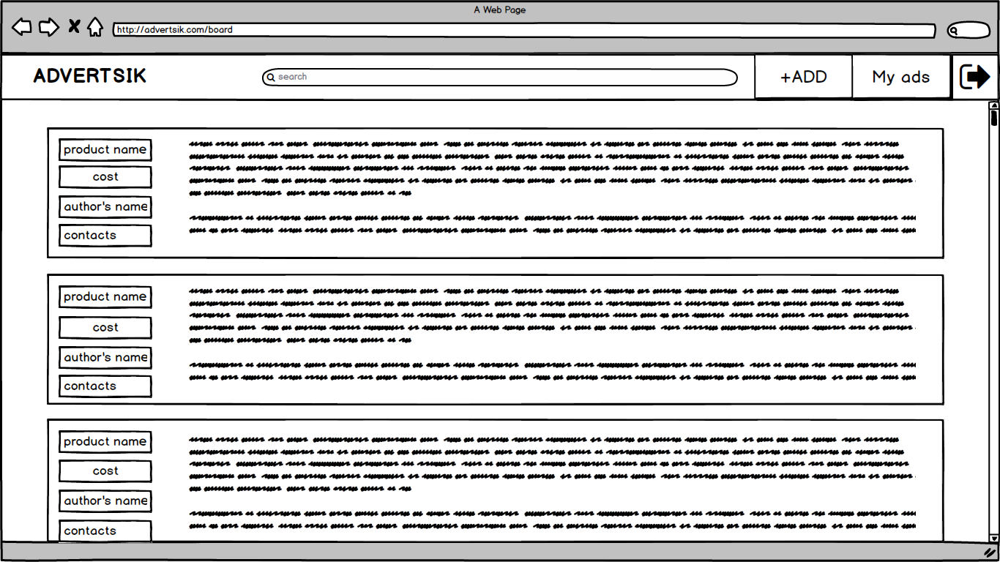
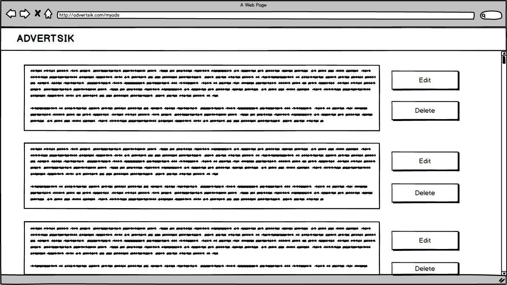

# Требования к проекту
---

# Содержание
1 [Введение](#intro)  
1.1 [Назначение](#appointment)  
1.2 [Бизнес-требования](#business_requirements)  
1.2.1 [Исходные данные](#initial_data)  
1.2.2 [Возможности бизнеса](#business_opportunities)  
1.2.3 [Границы проекта](#project_boundary)  
1.3 [Аналоги](#analogues)  
1.3.1 [Авито](#avito)  
1.3.2 [Куфар](#kufar)  
2 [Требования пользователя](#user_requirements)  
2.1 [Программные интерфейсы](#software_interfaces)  
2.2 [Интерфейс пользователя](#user_interface)  
2.3 [Характеристики пользователей](#user_specifications)  
2.3.1 [Классы пользователей](#user_classes)  
2.3.2 [Целевая аудитория](#target_audience)  
2.4 [Предположения и зависимости](#assumptions_and_dependencies)  
3 [Системные требования](#system_requirements)  
3.1 [Функциональные требования](#functional_requirements)  
3.1.1 [Основные функции](#main_functions)  
3.1.1.1 [Регистрация пользователя](#registration)  
3.1.1.2 [Авторизация зарегистрированного пользователя](#authorization)  
3.1.1.3 [Просмотр объявлений](#view_ads)  
3.1.1.4 [Добавление нового объявления](#adding_new_ad)  
3.1.1.5 [Просмотр своих объявлений](#view_your_ads)  
3.1.1.6 [Редактирование объявлений](#edit_ads)  
3.1.1.7 [Удаление объявлений](#delete_ads)  
3.1.1.8 [Выход из учётной записи](#log_out)  
3.1.2 [Ограничения и исключения](#restrictions_and_exclusions)  
3.2 [Нефункциональные требования](#non-functional_requirements)  
3.2.1 [Атрибуты качества](#quality_attributes)  
3.2.1.1 [Требования к удобству использования](#requirements_for_ease_of_use)  
3.2.1.2 [Требования к безопасности](#security_requirements)  
3.2.2 [Внешние интерфейсы](#external_interfaces)  

<a name="intro"/>

# 1 Введение

<a name="appointment"/>

## 1.1 Назначение
В этом документе описаны функциональные и нефункциональные требования к web-сайту для объявлений «Advertsik» на основе http-сервера. Этот документ предназначен для команды, которая будет реализовывать и проверять корректность работы сервиса.

<a name="business_requirements"/>

## 1.2 Бизнес-требования

<a name="initial_data"/>

### 1.2.1 Исходные данные
Практически каждый совершал покупки, в результате которых, купленная вещь не использовалась или была в обиходе всего несколько раз. И вот лежит она на полке и покрывается пылью годами, а выбросить жалко, ведь средства потрачены. Наилучшим выходом была бы продажа, но ходить и расклеивать объявления – занятие не из приятных. В таких случаях на помощь приходят газеты. Однако, и тут не без минусов, так как подача объявления в газету –  процедура платная. А ведь есть люди, которые бы с радостью приобрели у вас эту вещь за символическую плату, но и они сталкиваются с аналогичными трудностями.

<a name="business_opportunities"/>

### 1.2.2 Возможности бизнеса
Многие современные люди желают иметь сайт, который позволит размещать и просматривать объявления о товарах. Подобный интернет-сервис позволит им сэкономить время и средства при купле-продаже новых и бывших в употреблении вещей. 

<a name="project_boundary"/>

### 1.2.3 Границы проекта
Сайт для объявлений «Advertsik» позволит зарегистрированным пользователям размещать и просматривать объявления от других пользователей. Для анонимных пользователей предусмотрена возможность просмотра объявлений без доступа к контактным данным продавца.

<a name="analogues"/>

## 1.3 Аналоги

<a name="avito"/>

### 1.3.1 Авито
Одна из самых первых и самая известная российская торговая интернет-площадка с бесплатной регистрацией и огромным количеством продаваемых товаров. был создан 15 октября 2007 года. Основали компанию Йонас Нордландер и Филип Энгельберт. Формат подачи интернет площадки – доска объявлений. В плане полноценного магазина ресурс использовать будет очень неудобно. Однако, как средство привлечения дополнительного трафика, – это лучший вариант для частного предпринимателя. Среди преимуществ Avito — полностью русский интерфейс, крайне несложная процедура добавления лотов и простота совершения покупок. Минус — наличие платных опций, без которых пользоваться сайтом довольно неудобно, хотя дискомфорт и не критичен.
  

<a name="kufar"/>

### 1.3.2 Куфар
Куфар – самая известная и популярная онлайн-площадка бесплатных объявлений в Беларуси. Здесь вы найдёте как частные объявления о продаже и покупке новых и б/у товаров, так и предложения магазинов-партнёров Куфара. Особенность площадки является наличие собственной система расчёта. Так, чтобы выгодно подать объявление на "Куфар" или заказать рекламу на сервисе, продавцу потребуются "куфы" - так внутренняя валюта, приобрести которую можно путём внесения оплаты через банковскую карту. По отзывам пользователей минусом является жёсткое редактирование объявлений модераторами, и не лучшая обратная связь.
  

<a name="user_requirements"/>

# 2 Требования пользователя

<a name="software_interfaces"/>

## 2.1 Программные интерфейсы
Сайт обрабатывает запросы пользователя согласно протоколу http и хранит всю информцию в базе данных MySQL. Приложение реализовано на платформе Spring Framework.

<a name="user_interface"/>

## 2.2 Интерфейс пользователя
Страница авторизации пользователя.  
  
Главная страница.  
  
Страница взаимодействия с объявлениями пользователя.  
  
Страница добавления нового объявления пользователем.  
  

<a name="user_specifications"/>

## 2.3 Характеристики пользователей

<a name="user_classes"/>

### 2.3.1 Классы пользователей

| Класс пользователей | Описание |
|:---|:---|
| Анонимные пользователи | Пользователи, которые не зарегистрировались на сайте. Имеют частичный доступ к просмотру объявлений других пользователей. |
| Зарегистрированные пользователи | Пользователи, которые авторизовались на сайте с помощью E-mail’а и пароля, желающие просматривать и подавать объявления. Имеют доступ к полному функционалу сервиса. |

<a name="target_audience"/>

### 2.3.2 Целевая аудитория
Люди любой возрастной категории, обладающие минимальной компьютерной грамотностью.

<a name="assumptions_and_dependencies"/>

## 2.4 Предположения и зависимости
1.	Сайт не работает при отсутствии подключения к Интернету.
2.	Сайт не обрабатывает запросы в моменты отключения сервера.

<a name="system_requirements"/>

# 3 Системные требования

<a name="functional_requirements"/>

## 3.1 Функциональные требования

<a name="main_functions"/>

### 3.1.1 Основные функции

<a name="registration"/>

#### 3.1.1.1 Регистрация пользователя
Анонимный пользователь имеет возможность зарегистрироваться на сайте.

<a name="authorization"/>

#### 3.1.1.2 Авторизация зарегистрированного пользователя
Зарегистрированный пользователь имеет возможность войти в свой профиль.

<a name="view_ads"/>

#### 3.1.1.3 Просмотр объявлений
Авторизованный и анонимный пользователи имеют возможность просматривать объявления других пользователей. Анонимный пользователь не имеет доступа к контактным данным продавца. Авторизованный пользователь имеет доступ к полному функционалу.

<a name="adding_new_ad"/>

#### 3.1.1.4 Добавление нового объявления
Авторизованный пользователь может создать на сайте новое объявление.

<a name="view_your_ads"/>

#### 3.1.1.5 Просмотр своих объявлений
Авторизованный пользователь имеет возможность просмотра своих объявлений.

<a name="edit_ads"/>

#### 3.1.1.6 Редактирование объявлений
Авторизованный пользователь имеет возможность редактирования своих объявлений.

<a name="delete_ads"/>

#### 3.1.1.7 Удаление объявлений
Авторизованный пользователь имеет возможность удаления своих объявлений.

<a name="log_out"/>

#### 3.1.1.8 Выход из учётной записи
Пользователь имеет возможность выйти из своей учётной записи.

<a name="restrictions_and_exclusions"/>

### 3.1.2 Ограничения и исключения
1.	Сайт работает только при наличии подключения к Интернету.
2.	Сайт не обрабатывает запросы в моменты отключения сервера.

## 3.2 Нефункциональные требования

<a name="quality_attributes"/>

### 3.2.1 Атрибуты качества

<a name="requirements_for_ease_of_use"/>

#### 3.2.1.1 Требования к удобству использования
1.	Все функциональные элементы пользовательского интерфейса имеют названия, описывающие действие, которое произойдет при выборе элемента;
2.	Пошаговая инструкция использования основных функций сайта отображена в справке.

<a name="security_requirements"/>

#### 3.2.1.2 Требования к безопасности
Сервис предоставляет возможность редактирования объявлений только авторизованного пользователя.
Возможность просмотра контактных данных продавца только зарегистрированным пользователям.

<a name="external_interfaces"/>

### 3.2.2 Внешние интерфейсы
1.	Размер шрифта не менее 14пт;
2.	Функциональные элементы контрастны фону;
3.	Название и символы элементов интерфейса напрямую описывают их функционал.

