# Представление результатов

| ID | Назначение/название | Сценарий | Ожидаемый результат | Фактический результат | Оценка |
|:---:|:---:|:---|:---|:---|:---|
| 1 | Регистрация нового аккаунта пользователя | 1. Перейдите по адресу сайта на [страницу авторизации](#1).  2. Нажмите кнопку "Add new user".  3. На открывшейся [странице](#2) введите имя пользователя, пароль и e-mail. 4. Нажмите кнопку "Create".| Произошло перенаправление на [страницу авторизации](#1) сайта. | X | X |
| 2 | Регистрация уже сущестующего аккаунта пользователя | 1. Перейдите по адресу сайта на [страницу авторизации](#1).  2. Нажмите кнопку "Add new user".  3. На открывшейся [странице](#2) введите имя пользователя уже сущестующего в системе, а так же пароль и e-mail. 4. Нажмите кнопку "Create".| [На странице](#3) появилось cообщение "User exists!". | X | X |
| 3 | Регистрация нового аккаунта без заполнения полей | 1. Перейдите по адресу сайта на [страницу авторизации](#1).  2. Нажмите кнопку "Add new user".  3. На открывшейся [странице](#2) нажмите кнопку "Create".| [На странице](#4) появились предупреждающие сообщения. | X | X |
| 4 | Вход в незарегистрированный аккаунт | 1. Перейдите по адресу сайта на [страницу авторизации](#1).  2. Введите имя и пароль пользователя, не сущестующего в системе.  3. Нажмите кнопку "Sign in". | [На странице](#5) появилось cообщение "Bad credentials". | X | X |
| 5 | Вход в зарегистрированный аккаунт c неправильным паролем | 1. Перейдите по адресу сайта на [страницу авторизации](#1).  2. Введите имя и неверный пароль пользователя, сущестующего в системе.  3. Нажмите кнопку "Sign in". | [На странице](#5) появилось cообщение "Bad credentials". | X | X |
| 6 | Вход в зарегистрированный аккаунт | 1. Перейдите по адресу сайта на [страницу авторизации](#1).  2. Введите имя и пароль пользователя, сущестующего в системе.  3. Нажмите кнопку "Sign in". | Произошло перенаправление на [страницу с доской объявлений](#12). | X | X |
| 7 | Вход в аккаунт без заполнения полей | 1. Перейдите по адресу сайта на [страницу авторизации](#1).  2. Нажмите кнопку "Sign in". | [На странице](#5) появилось cообщение "Bad credentials". | X | X |
| 8 | Добавление нового объявления без изображения | 1. Выполните сценарий 6.  2. Нажмите кнопку "New ad".  3. На открывшейся [странице](#6) введите заголовок и текст объявления. 4. Нажмите кнопку "Save".| Произошло перенаправление на [страницу с доской объявлений](#12). Отобразилось добавленное объявление.| X | X |
| 9 | Добавление нового объявления с изображения | 1. Выполните сценарий 6.  2. Нажмите кнопку "New ad".  3. На открывшейся [странице](#6) введите заголовок, текст объявления и выбирите изображение. 4. Нажмите кнопку "Save".| Произошло перенаправление на [страницу с доской объявлений](#12). Отобразилось добавленное объявление.| X | X |
| 10 | Добавление пустого объявления | 1. Выполните сценарий 6.  2. Нажмите кнопку "New ad".  3. На открывшейся [странице](#6) нажмите кнопку "Save".| [На странице](#7) появились cообщения "Please fill the title" и "Please fill the description". | X | X |
| 11 | Просмотр личных объявлений | 1. Выполните сценарий 6.  2. Нажмите кнопку "My ads".  | Произошло перенаправление на [странцу с личными объявлениями](#13). | X | X |
| 12 | Редактирование личных объявлений | 1. Выполните сценарий 11.  2. Нажмите кнопку "Edit"  3. На открывшейся [странице](#8) измените значение полей.  4. Нажмите кнопку "Save". | Произошло перенаправление на [страницу с личными объявлениями](#9). Редактируемое сообщение обновилось. | X | X | 
| 13 | Удаление изображения в личном объявлении | 1.Выполните сценарий 11.  2. Нажмите на "крестик".   | Изображение удалилось. | X | X | 
| 14 | Удаление личных объявлений | 1. Выполните сценарий 11.  2. Нажмите кнопку "Delete"  | Объявление удалилось. | X | X | 
| 15 | Поиск по имеющемуся заголовку | 1. Введите имеющийся в базе сайта заголовок в строку поиска.  2. Нажмите кнопку "Search"  | [На странице](#10) отобразились объявления с указанным заголовком | X | X |
| 16 | Поиск по неимеющемуся заголовку | 1. Введите неимеющийся заголовок в строку поиска.  2. Нажмите кнопку "Search"  | [На странице](#11) появилась надпись "No ads" | X | X |
| 17 | Выход из аккаунта | 1. Выполните сценарий 6.  2. Нажмите кнопку "Sign out"  | Произошло перенаправление на [странцу авторизации](#1). | X | X |

# Иллюстрации

<a name="1"/>

Рисунок 1.
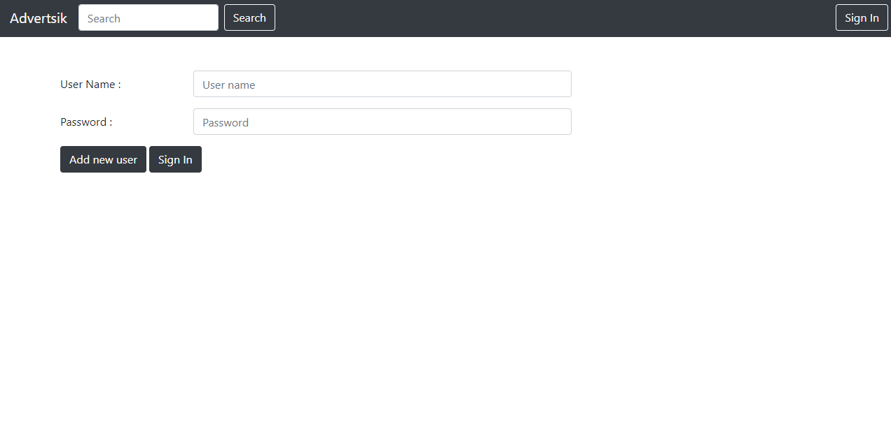

<a name="2"/>

Рисунок 2.
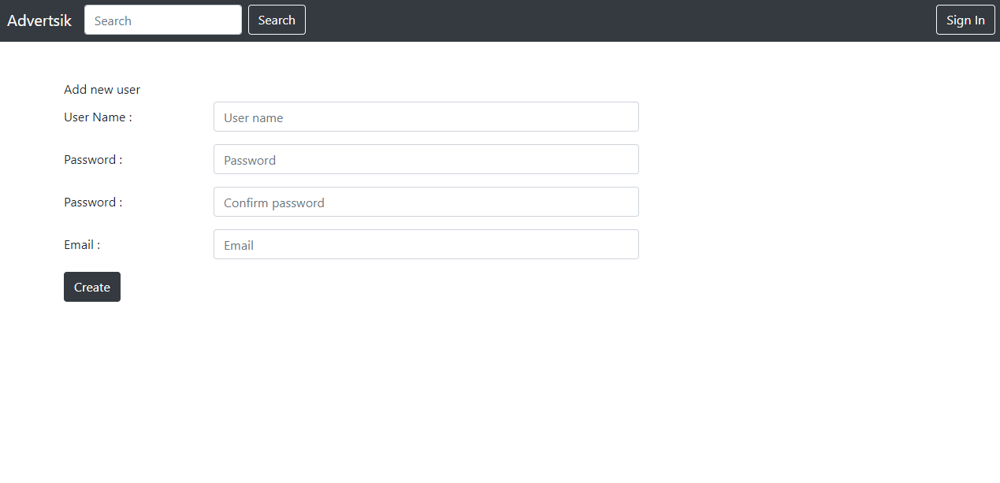

<a name="3"/>

Рисунок 3.
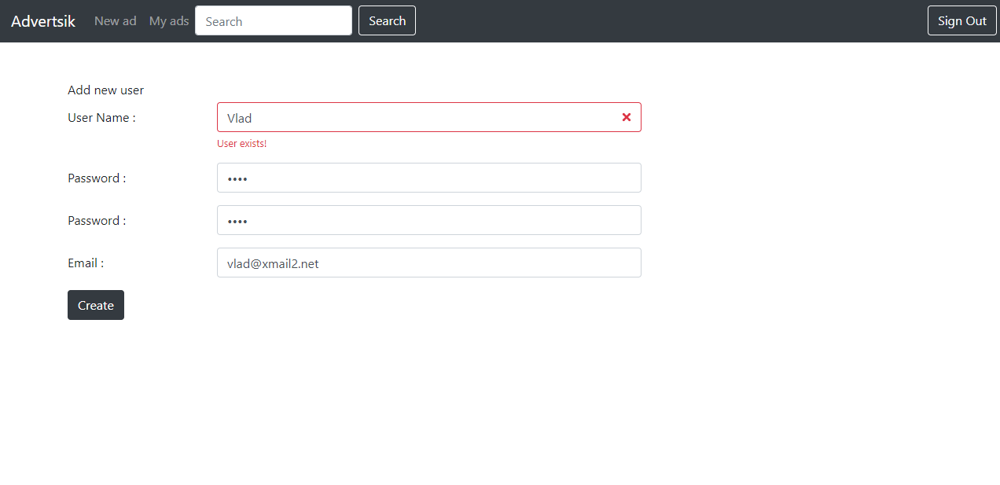

<a name="4"/>

Рисунок 4.
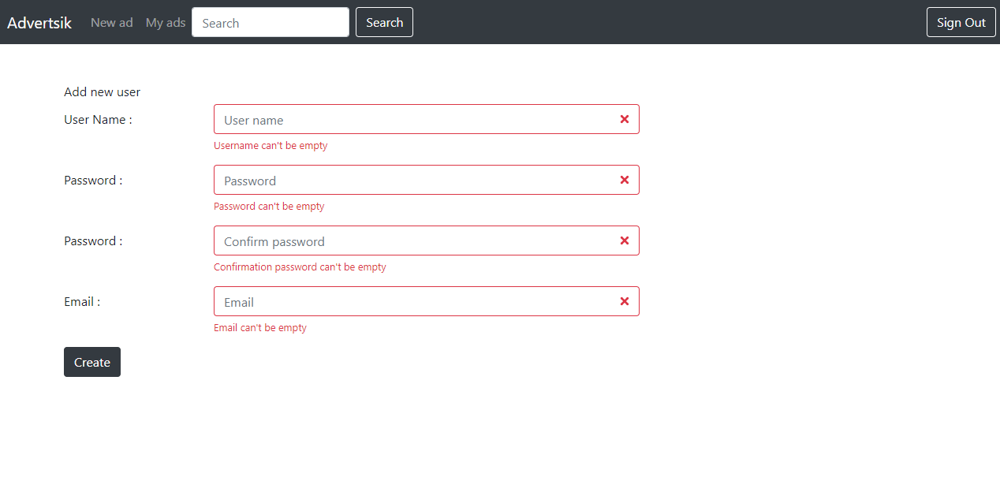

<a name="5"/>

Рисунок 5.
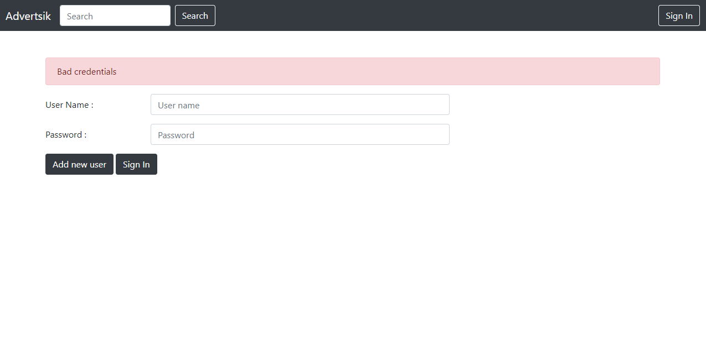

<a name="6"/>

Рисунок 6.
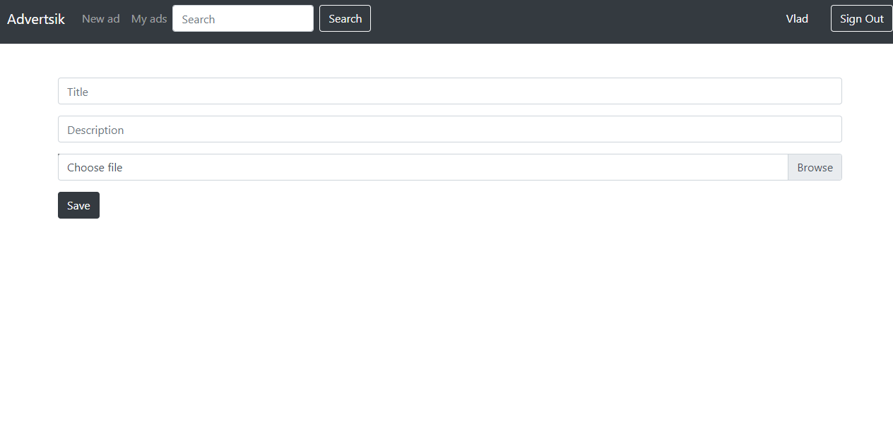

<a name="7"/>

Рисунок 7.
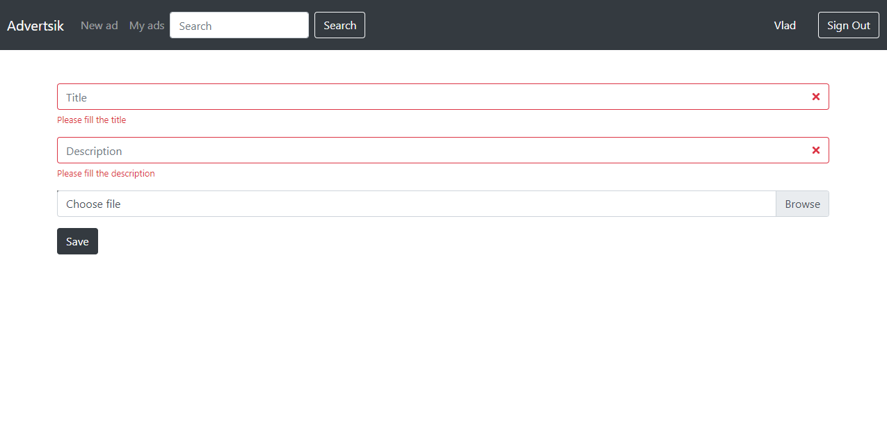

<a name="8"/>

Рисунок 8.
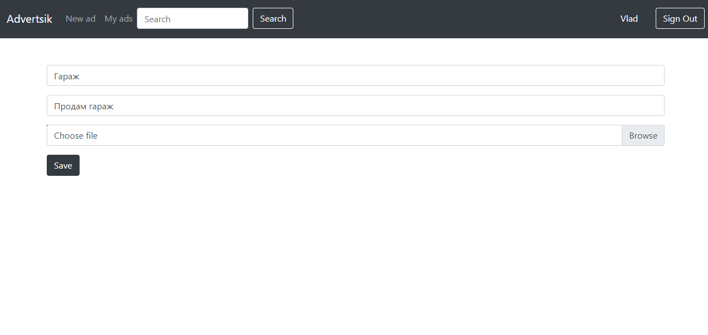

<a name="9"/>

Рисунок 9.
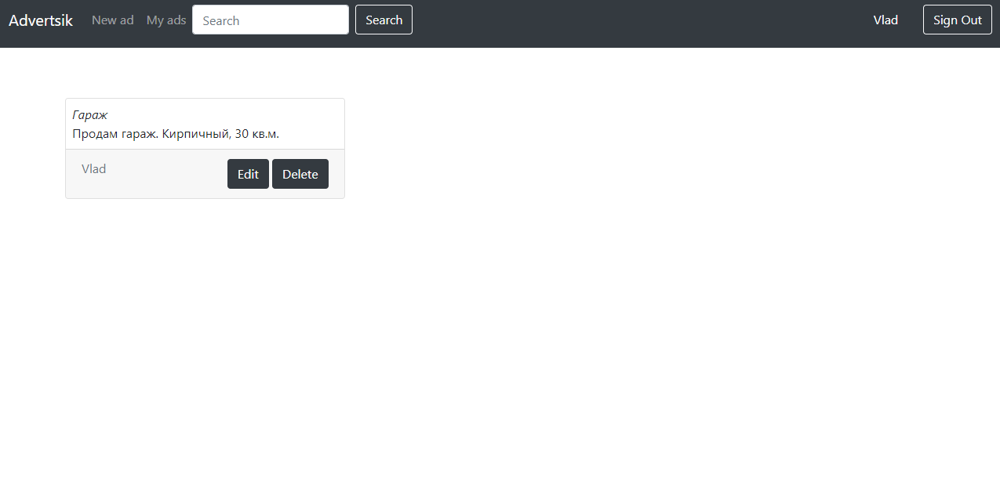

<a name="10"/>

Рисунок 10.
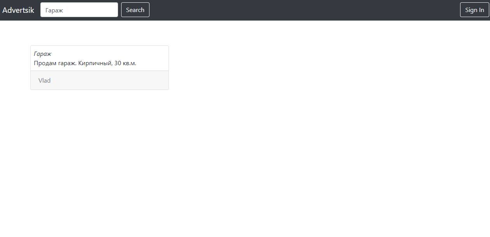

<a name="11"/>

Рисунок 11.
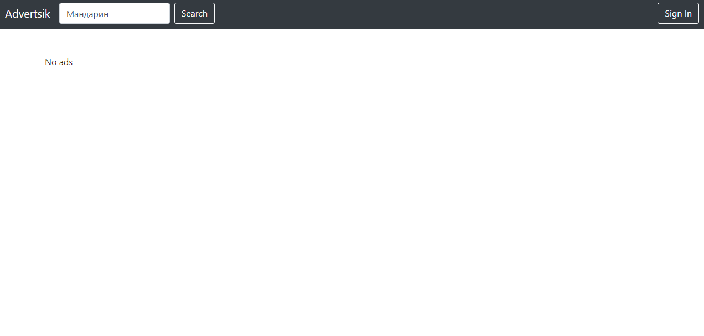

<a name="12"/>

Рисунок 12.
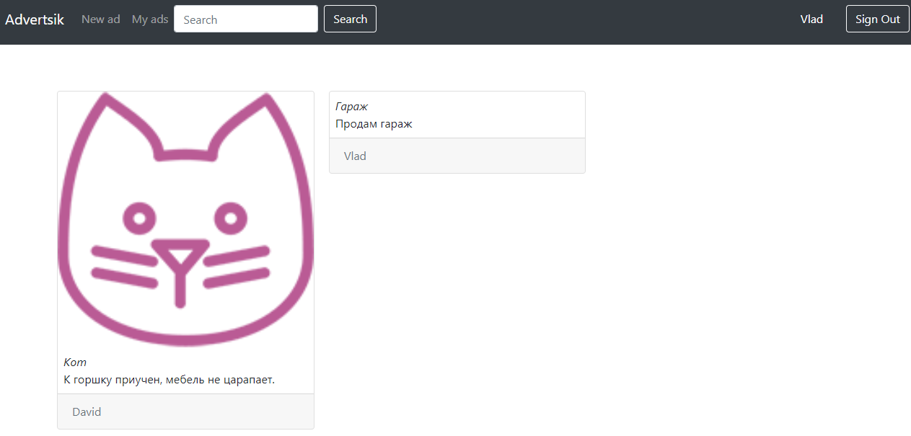

<a name="13"/>

Рисунок 13.
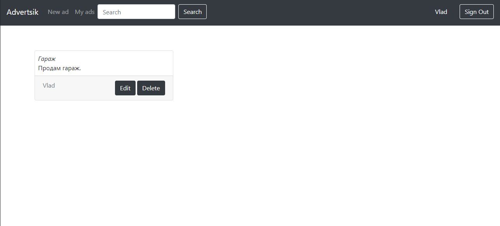